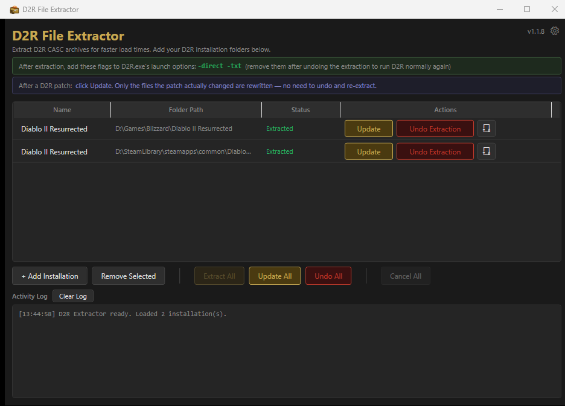
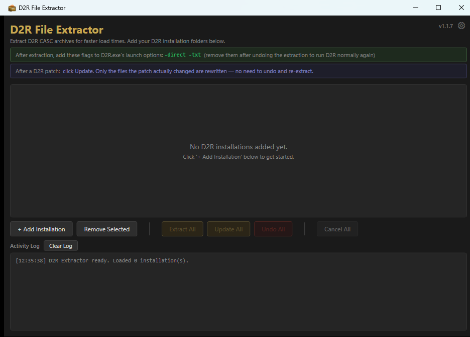
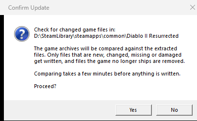
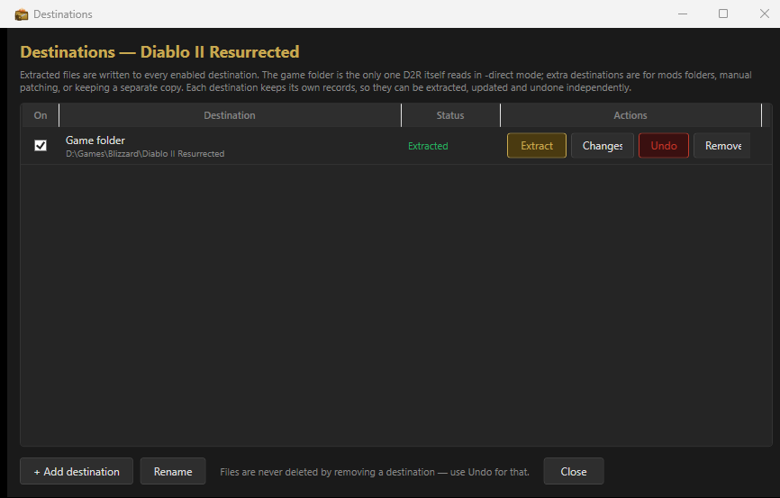
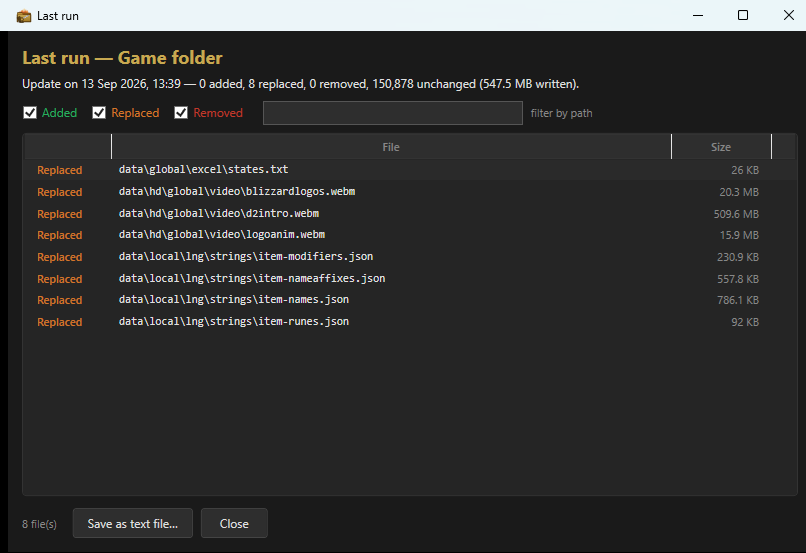
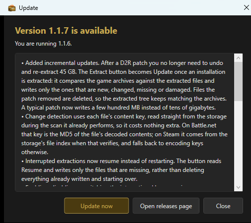
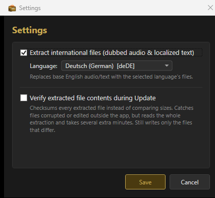

# D2R File Extractor

**Cut Diablo II: Resurrected's load times by unpacking its game archives — one click, and one click to put them back.**

D2R reads its art, sound and data out of compressed archives every time it loads
a zone. Unpack them to plain files and the game stops decompressing and starts
reading, which is where the loading time goes. This app does that for you, keeps
track of every file it wrote, and can undo the whole thing.

[](https://github.com/levinium/D2RExtractor/releases/latest)
[](https://github.com/levinium/D2RExtractor/releases)

[](https://github.com/sponsors/levinium)



## Download

**[Download D2RExtractor-Compiled-Standalone_v1.1.7.zip](https://github.com/levinium/D2RExtractor/releases/download/D2RExtractor_v1.1.7/D2RExtractor-Compiled-Standalone_v1.1.7.zip)** (63 MB)

Unzip it anywhere and run `D2RExtractor.exe`. That is the whole installation.
There is no setup step, no admin prompt and no registry entry, because the .NET
runtime it needs is inside the folder. Delete the folder and it is gone. You
need 64-bit Windows and nothing else.

Windows SmartScreen will warn that the app is unsigned. Choose **More info**
then **Run anyway**, or read the source and build it yourself.

Prefer to watch someone do it first? There is a
**[YouTube installation and usage guide](https://youtu.be/dpQtSIhVfrc)**.

## Getting started



1. Press **+ Add Installation** and pick your D2R folder — the one containing
   the `Data` folder. Battle.net and Steam are both fine, and you can add as
   many as you have.
2. Press **Extract**, and leave it running. Battle.net takes roughly 30–45
   minutes; Steam is limited only by how fast your disk writes.
3. Add `-direct -txt` to D2R's launch options, and play.

That is all of it. Step 3 is the one people forget: without those flags the game
ignores the files you just extracted and nothing changes.

Two things worth knowing before you start. Each installation needs about
**40–45 GB of free space** — more if you also extract international audio — so
check the drive first. And add your D2R folder to **Windows Defender's exclusion
list**; scanning 150,000 freshly written game files as D2R opens them gives back
a good part of the speed you came for.

## What it does

### After a patch, it updates instead of starting over

This is the part that makes the app worth keeping rather than running once.

Blizzard patches D2R, and the extracted files no longer match the archives. The
old answer was to undo the whole extraction and redo it: 45 GB of writing to
replace what is usually a few hundred megabytes of genuinely changed art.

Once an installation is extracted, the **Extract** button becomes **Update**. It
compares the archives against what is on your disk and writes only the files
that are new, changed, missing or damaged, then deletes the ones the patch
removed so your extracted copy keeps matching the game. A typical patch now
takes minutes and a few hundred MB of writes — much faster, and much kinder to
an SSD.



You no longer need to undo before patching. And if an extraction is interrupted
— you closed the app, the machine rebooted — the button reads **Resume** and
writes only what is missing rather than starting from nothing.

### It knows exactly what it wrote

Every extracted file is recorded along with its content key, the fingerprint the
game's own storage keeps for it. That record is what lets **Undo Extraction**
remove precisely the files the app created and leave everything else alone, and
what lets an update tell a changed file from an unchanged one without reading
all 45 GB back.

Reading those keys costs nothing extra: they come out of the same scan the
extractor already performs.

### It handles both Battle.net and Steam

The app detects which storage format each installation uses and picks the right
reader, with no setting to get wrong.

Battle.net installs use the classic CASC layout, read through Ladislav Zezula's
[CascLib](https://github.com/ladislav-zezula/CascLib) — the same engine behind
[Ladik's CASC Viewer](http://www.zezula.net/en/casc/main.html).

Steam moved in mid-2026 (game build 93236+) to a newer self-contained storage
format that CascLib does not support, which is what broke Steam extraction at
the time. D2RExtractor now reads that format with a built-in native reader,
entirely from the files already on your disk: **no internet connection
required**, unlike the CDN-download workaround older versions needed. Both
readers produce an identical set of files, so it makes no difference to the
game which one you started from.

### You can choose where it extracts to



By default an installation extracts into the game folder, which is the only place
D2R itself reads in `-direct` mode. That is the whole story for most people, and
the feature below costs nothing to ignore.

The folder button on each row opens **Destinations**, where you can add more. Every
Extract and Update then writes to all of them, one after another — which is what
makes a mods folder, or a separate copy for manual patching, practical to keep in
step with the game.

Each destination keeps its own records. They can be extracted, updated and undone
independently, and a destination that shares a folder with files of your own loses
exactly what this app put there and nothing else. The game folder can be turned off
like any other destination; the app just says plainly when nothing is writing there,
because then the game gains nothing and `-direct -txt` will find no files.

Destinations cannot be nested inside one another. Each one's update treats
unrecognized files under its tree as leftovers a patch removed, so overlapping
destinations would quietly delete each other's files.

### It records what each run changed



After an update, **Changes** in the Destinations window lists every file that run
added, replaced or removed, with sizes, a filter, and a plain-text export. It is
the answer to "what did that patch actually touch?", which is otherwise
unanswerable once the run is over.

Only the last run is kept, per destination. A fresh extraction records a summary
rather than a list, because every one of its ~150,000 files is an addition and the
list would just be the manifest again.

### It keeps itself up to date



When a newer version is published, an **Update to …** button appears at the top
right. Press it and the app shows you what changed, then installs it: it
downloads the release, checks it against the checksum GitHub recorded when it
was uploaded, unpacks it, replaces itself and restarts.

A failed update costs nothing but the download. Your existing copy is set aside
before anything is replaced and put back if the swap does not complete, and a
download that does not match its checksum is discarded without touching
anything. Updating is refused while an extraction is running, because swapping
the app out partway through writing 45 GB would leave an extraction that no
longer matches its own records.

The check runs in the background at most once a day and never interrupts: it
lights up the button and waits. Nothing is downloaded or installed until you
press it. **Check for Updates** in the gear menu asks on demand, and the daily
check can be turned off in Settings. It sends no identifier and nothing about
your machine or your game folders — it is a plain request for a public file.

### It can extract other languages



International files — dubbed audio and localized text — are off by default.
Turn them on and pick from German, Spanish (Spain or Latin America), French,
Italian, Japanese, Korean, Polish, Portuguese (Brazil), Russian, Chinese
(Simplified or Traditional), and the selected language replaces the base English
files. Changing your mind later is an ordinary update: only the affected files
are rewritten, and turning it back off restores English.

The other setting, **Verify extracted file contents during Update**, checksums
every extracted file instead of comparing sizes. It catches files corrupted or
edited outside the app, reads the whole extraction so it takes several extra
minutes, and still writes only the files that actually differ. Leave it off
unless something looks wrong.

## Undoing it

Press **Undo Extraction** and the extracted files are removed, empty folders
pruned, and anything you put in that tree yourself left untouched. Then take
`-direct -txt` back out of your launch options and D2R runs normally again.

## Supporting it

D2R File Extractor is free and open source. There is no paid version and
nothing is held back. If it has saved you some loading screens, you can put
something toward keeping it working after the next patch:

**[❤ Sponsor on GitHub](https://github.com/sponsors/levinium)**

Release builds carry a matching **Support** button in the app, next to the
version number; a build from a clean checkout does not. The destination is a
build property, empty in this repository, and with nothing set the button does
not render at all — so a fork ships no ask, and there is nothing to remember to
strip out.

## Building from source

Needs the .NET 8 SDK, and a copy of `CascLib.dll` placed in
`D2RExtractor\Tools\` before building.

```powershell
dotnet build D2RExtractor.sln -c Release -p:Platform=x64
```

Output: `D2RExtractor\bin\x64\Release\net8.0-windows\D2RExtractor.exe`

To build the release zip — self-contained, single file, no .NET runtime needed
on the target machine:

```powershell
.\publish.ps1
.\publish.ps1 -SponsorUrl "https://github.com/sponsors/<user>?frequency=one-time&amount={amount}"
```

An `{amount}` placeholder turns the ask into a picker — $3 / $5 / $10 / $25 and
Other, defaulting to $5 — with the chosen sum substituted into the link. Only
worth including where the destination actually reads an amount out of the URL:
offering a choice the payment page never hears about is worse than not asking.

## How it is put together

```
D2RExtractor\
├── Models\
│   ├── D2RInstallation.cs       Observable model for each managed installation
│   ├── ExtractionTarget.cs      One destination, with its own manifest and state
│   ├── ExtractionChange.cs      What a run added, replaced or removed
│   └── ExtractionManifest.cs    Per-destination record of extracted files
├── Services\
│   ├── CascExtractorService.cs  Format detection + extract / update / undo logic
│   ├── IExtractionBackend.cs    Backend abstraction (CascLib vs Steam native)
│   ├── ManifestService.cs       JSON settings + manifest persistence
│   ├── UpdateService.cs         Reads the releases feed
│   ├── UpdateInstaller.cs       Downloads, verifies and swaps in a new version
│   └── Steam\                   Native reader for the Steam static-container format
│       ├── SteamBuildConfig.cs  Parses data\.build.config
│       ├── StaticContainer.cs   EKey → data-file location + blob reads
│       ├── Blte.cs              BLTE block decoder
│       ├── Tvfs.cs              TVFS file-tree parser
│       └── SteamStaticStorage.cs  Enumerate + extract entry point
├── Native\
│   └── CascLib.cs               P/Invoke declarations for CascLib.dll (Battle.net)
└── Tools\
    └── CascLib.dll              (place your copy here before building)
```

Both storage formats sit behind one `IExtractionBackend`, so there is a single
extraction, manifest and progress loop rather than one per format. That is why
Steam support arriving in 1.1.5 did not change anything about how Battle.net
installs behave, and why the two produce byte-identical output trees.

The other seam worth knowing about is that an installation's folder is the
**source** — where the archives are read from — while an `ExtractionTarget` is the
**destination**. Until 1.1.8 those were the same string in the same property, which
is the only reason extracting anywhere else was not possible before.

### Where the records live

**Settings** are in `%AppData%\D2RExtractor\settings.json`, which also holds each
installation's list of destinations.

**Manifests** live inside each destination, not centrally:
`<destination>\data\.extraction_manifest.json` holds a small header, and
`<destination>\data\.extraction_files.txt` holds one record per extracted file —
path, content key, size. Beside them, `.extraction_run.json` and
`.extraction_changes.txt` record what the last run did.

Keeping the records in the destination is what makes destinations independent, and
it is why upgrading from 1.1.7 needs no migration: the manifest was already there,
which is exactly where the default destination looks for it.

That split is deliberate. The manifest used to be one JSON file rewritten in
full every 500 files, so its cost grew with the square of the file count: about
1.5 GB of writes across a typical 150,000-file extraction, before any game data.
An append-only sidecar beside a ~300 byte header brings that down to a single
~15 MB write, even while recording a content key for every file.

> Manifests written by 1.1.7 are not readable by 1.1.6 and earlier — those
> versions would see an empty file list and their Undo would remove nothing.
> Existing 1.1.6 manifests are upgraded automatically on the first Update.

## Version history

See [CHANGELOG.md](CHANGELOG.md).

## Third-party components

| Component | License | Used for |
| --- | --- | --- |
| [CascLib](https://github.com/ladislav-zezula/CascLib) | MIT | reading classic CASC storage (Battle.net) |
| Newtonsoft.Json | MIT | settings and manifest persistence |

Diablo II: Resurrected is a trademark of Blizzard Entertainment. This is an
unofficial tool and is not affiliated with or endorsed by Blizzard.
